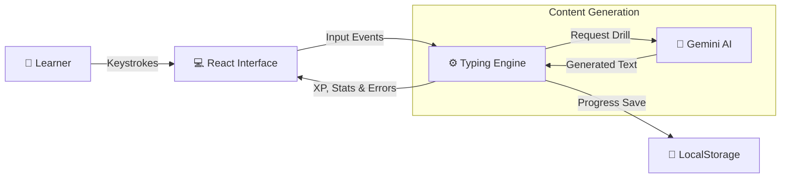

# Teclado Mágico | Magic Keyboard

> **EN**: A gamified, AI-powered typing trainer designed for children learning European Portuguese.
> **PT**: Um treinador de digitação gamificado e impulsionado por IA, desenhado para crianças a aprender Português Europeu.

[](LICENSE)
[](https://www.typescriptlang.org/)
[](https://react.dev/)
[](https://deepmind.google/technologies/gemini/)
[](https://github.com/yourusername/teclado-magico)

---

## 📊 Current Status | Estado Actual (January 2025)

| Module | Status EN | Estado PT |
|--------|-----------|-----------|
| **Core Typing Engine** | ✅ Complete | ✅ Completo |
| **Visual Keyboard** | ✅ Complete | ✅ Completo |
| **AI Text Generation** | ✅ Complete | ✅ Completo |
| **Progression (XP/Levels)**| ✅ Complete | ✅ Completo |
| **Daily Challenges** | ✅ Complete | ✅ Completo |
| **Hand Guide** | ✅ Complete | ✅ Completo |
| **Data Privacy (GDPR)** | ✅ Complete | ✅ Completo |
| **Teacher Dashboard** | 🔮 Planned | 🔮 Planeado |

---

## 🎯 Overview | Visão Geral

### EN-US
**Teclado Mágico** is an educational web application that helps children master touch typing. Unlike generic tools, it focuses specifically on **European Portuguese** vocabulary and grammar (addressing the user as "Tu" instead of "Você"), making it culturally appropriate for Portugal and Angola. It uses Google's Gemini AI to generate infinite, context-aware typing drills.

### PT-PT
**Teclado Mágico** é uma aplicação web educativa que ajuda crianças a dominar a digitação. Ao contrário de ferramentas genéricas, foca-se especificamente no vocabulário e gramática do **Português Europeu** (tratando o utilizador por "Tu"), tornando-a culturalmente apropriada para Portugal e Angola. Utiliza a IA Gemini da Google para gerar exercícios infinitos e conscientes do contexto.

---

## ✨ Core Features | Funcionalidades Principais

### 1. Progressive Learning | Aprendizagem Progressiva
- **EN**: 7 distinct levels starting from the Home Row (F & J) expanding outward. Includes a visual "Hand Guide" modal teaching correct finger placement.
- **PT**: 7 níveis distintos começando pela Linha Base (F & J) e expandindo. Inclui um "Guia de Mãos" visual que ensina a posição correta dos dedos.

### 2. RPG Progression System | Sistema de Progressão RPG
- **EN**: Earn **XP** for every key pressed. Level up to unlock cool **Titles** (e.g., "Keyboard Legend") and collect fun **Avatars**.
- **PT**: Ganha **XP** por cada tecla. Sobe de nível para desbloquear **Títulos** fixes (ex: "Lenda do Teclado") e colecionar **Avatares** divertidos.

### 3. Daily Challenges | Desafios Diários
- **EN**: A new mission every day (e.g., "Reach 30 WPM", "Get 3 Stars") to keep engagement high, rewarding bonus XP.
- **PT**: Uma nova missão todos os dias (ex: "Chegar às 30 PPM", "Conseguir 3 Estrelas") para manter o interesse, com bónus de XP.

### 4. AI-Powered Drills | Exercícios com IA
- **EN**: Google Gemini integration generates unique sentences every time • Context-aware vocabulary • Error-focused drill generation.
- **PT**: Integração Google Gemini gera frases únicas a cada vez • Vocabulário consciente do contexto • Geração de exercícios focados nos erros.

### 5. Gamification | Gamificação
- **EN**: Star rating system • Confetti celebrations • Visual feedback • Time Attack modes • Achievements (Badges).
- **PT**: Sistema de classificação por estrelas • Celebrações com confetes • Feedback visual • Modos Contra-Relógio • Conquistas (Medalhas).

### 6. Privacy First | Privacidade Primeiro
- **EN**: 100% LocalStorage based. No database, no tracking, no personal data collection. Includes GDPR-compliant Data Erasure.
- **PT**: 100% baseado em LocalStorage. Sem base de dados, sem rastreamento, sem recolha de dados pessoais. Inclui eliminação de dados compatível com RGPD.

---

## 🏗️ Architecture | Arquitectura

### Tech Stack | Stack Tecnológico

| Component | Technology | Purpose |
|-----------|-----------|---------|
| **Frontend** | React 19 + TypeScript | UI & Game Logic |
| **Styling** | Tailwind CSS | Responsive Design |
| **Animations** | Framer Motion | Smooth transitions & feedback |
| **AI Engine** | Google GenAI SDK | Dynamic Content Generation |
| **Charts** | Recharts | Progress Visualization |
| **Icons** | Lucide React | Visual Language |

### Data Flow



---

## 🚀 Getting Started | Começar

### Prerequisites | Pré-requisitos
- Node.js 18+ 
- Google Gemini API Key

### Installation | Instalação

**1. Clone the repository | Clonar o repositório**
```bash
git clone https://github.com/yourusername/teclado-magico.git
cd teclado-magico
```

**2. Install dependencies | Instalar dependências**
```bash
npm install
# or
pnpm install
```

**3. Configure Environment | Configurar Ambiente**
Create a `.env` file:
```env
API_KEY=your_api_key_here
```

**4. Start development server | Iniciar servidor**
```bash
npm run dev
```

---

## 🤝 Contributing | Contribuir

**EN**: We welcome contributions! Please read [CONTRIBUTING.md](CONTRIBUTING.md) for our language guidelines (pt-PT vs pt-BR).

**PT**: Acolhemos contribuições! Por favor, leia [CONTRIBUTING.md](CONTRIBUTING.md) para as nossas diretrizes de linguagem (pt-PT vs pt-BR).

---

## 📄 License | Licença

This project is licensed under the MIT License - see [LICENSE](LICENSE) file for details.

---

**Made with ❤️ for education | Feito com ❤️ para a educação**