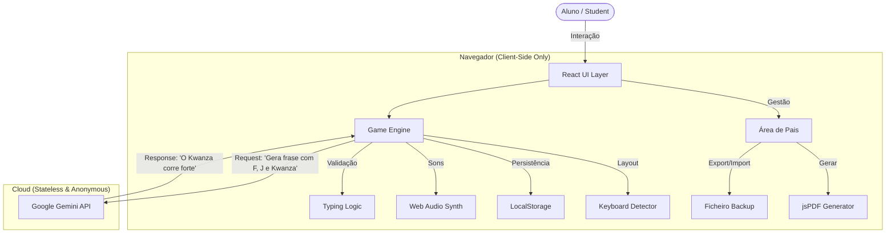

# Teclado Mágico 🇵🇹 🇦🇴
### O Treinador de Digitação com Alma Lusófona
### *The Typing Trainer with a Lusophone Soul*

[](LICENSE)
[](package.json)
[](https://github.com/clrogon/MagicKeyboard)
[](https://react.dev/)

---

## 📸 Galeria | Screenshots

<p align="center">
  
  
</p>

<p align="center">
  <strong>Interface amigável para crianças (Esq.) e Dashboard de gestão para Pais/Professores (Dir.)</strong>
</p>

---

## 🌟 Porquê o Teclado Mágico? | Why Magic Keyboard?

**O Problema:** A maioria dos treinadores de digitação online ou são apenas em Inglês ou, quando em Português, utilizam vocabulário e gramática do Brasil (PT-BR). Para crianças em **Portugal** e **Angola**, isto cria confusão linguística (ex: "tela" vs "ecrã", "mouse" vs "rato", uso do gerúndio).

**A Solução:** O **Teclado Mágico** é uma plataforma educativa "Privacy-First" que utiliza Inteligência Artificial para gerar exercícios infinitos, culturalmente relevantes e gramaticalmente corretos para o contexto Luso-Afro-Europeu.

> **Our Mission:** To provide a safe, engaging, and culturally accurate typing environment for children in the CPLP (Community of Portuguese Language Countries), specifically focusing on the linguistic nuances of Portugal and Angola.

---

## 📚 Documentação Oficial | Documentation

Toda a informação detalhada sobre o projeto encontra-se na pasta `/docs`:

*   🎓 **[Pedagogia e Método de Ensino](docs/PEDAGOGY.md)**: Como o método funciona, estrutura dos 17 níveis e lógica da IA.
*   👨‍👩‍👧‍👦 **[Guia para Pais e Professores](docs/PARENTS_GUIDE.md)**: Manual de utilização, instalação, **privacidade** e ferramentas de gestão.
*   🗺️ **[Roteiro do Projeto (Roadmap)](ROADMAP.md)**: O passado, presente e futuro do desenvolvimento.
*   🛡️ **[Política de Segurança e Privacidade](SECURITY.md)**: Detalhes sobre dados locais, GDPR e anonimização de IA.

---

## 🚀 Funcionalidades de Destaque | Feature Highlights

### 🛡️ Soberania de Dados (Privacy by Design)
A segurança das crianças é a nossa prioridade número um.
*   **Sem Base de Dados**: Não temos servidores para guardar dados de utilizadores.
*   **Armazenamento Local**: Todo o progresso, XP e perfis são guardados encriptados no dispositivo (LocalStorage).
*   **Anonimato na IA**: Quando pedimos frases à Google, enviamos pedidos anónimos (ex: "Gera uma frase com a letra J"). Nenhum dado da criança é enviado para a cloud.
*   **GDPR/RGPD**: Totalmente compatível com as normas europeias de proteção de dados, incluindo ferramentas de Exportação/Eliminação de dados.

### 🧠 Inteligência Artificial Contextual (Gemini Powered)
Ao contrário de sites que repetem as mesmas frases estáticas, o Teclado Mágico usa a **API Google Gemini** para criar conteúdos dinâmicos.
*   **Adaptação Cultural**: O sistema sabe a diferença entre o Tejo e o Kwanza. Gera frases sobre *Imbondeiros*, *Pastéis de Nata*, *Palancas Negras* e *Elétricos de Lisboa*.
*   **Correção de Erros em Tempo Real**: Se a criança falha muito nas teclas "A" e "S", a IA gera automaticamente um "Treino de Dificuldades" focado nessas letras.
*   **Zero Alucinações**: Prompting rigoroso garante que o conteúdo é seguro para crianças e pedagogicamente útil.

### 🌍 Internacionalização (v1.5.0)
Suporte para comunidades portuguesas no estrangeiro e escolas internacionais.
*   **Deteção Automática de Teclado**: O sistema deteta se o teclado físico é QWERTY (PT) ou AZERTY (FR/BE) e ajusta as lições.
*   **Teclado Visual Adaptável**: O guia visual no ecrã muda instantaneamente para corresponder ao hardware do aluno.

### 🎮 Gamificação RPG
Aprender não tem de ser aborrecido. Transformámos a digitação num jogo.
*   **Sistema de XP e Níveis**: Evolui de "Aprendiz" até "A Lenda do Teclado".
*   **Streak Diário**: Incentivos para a prática diária consistente.
*   **Desafios Aleatórios**: Missões diárias (ex: "Atinge 98% de precisão") com recompensas extra.
*   **Avatares e Temas**: Personalização visual com temas de alto contraste (Rosa, Azul, Âmbar).

### 🎓 Ferramentas para Pais e Professores
*   **Lições Personalizadas**: O professor pode criar um ditado específico ou lista de palavras para TPC.
*   **Certificados Oficiais**: Geração de Diplomas em PDF diretamente no navegador para celebrar a conclusão de níveis.
*   **Backup e Portabilidade**: Exporte o progresso do aluno para um ficheiro JSON e leve-o para outro computador.
*   **Modo Ditado (Acessibilidade)**: Utiliza síntese de voz (TTS) para ditar palavras, treinando a ortografia auditiva.

---

## 🗺️ Inclusão Cultural: Portugal & Angola

Este projeto celebra a lusofonia. Os níveis avançados e o Modo História introduzem vocabulário específico:

| Categoria | Portugal 🇵🇹 | Angola 🇦🇴 |
|-----------|-------------|-----------|
| **Geografia** | Tejo, Serra da Estrela, Algarve, Douro | Kwanza, Lubango, Cabinda, Huambo, Malanje |
| **Cultura** | Fado, Galo de Barcelos, Azulejo | Semba, Kizomba, Pensador, Soba |
| **Fauna/Flora**| Lince Ibérico, Sobreiro | Palanca Negra, Imbondeiro, Welwitschia |
| **Culinária** | Sardinha, Caldo Verde, Pastel de Nata | Muamba, Funge, Ginguba, Mufete |

---

## 🏗️ Arquitetura Técnica | Technical Architecture

O Teclado Mágico é uma **Progressive Web App (PWA)**, o que significa que pode ser instalada no computador/tablet e funciona **Offline**.

### Stack
*   **Frontend**: React 19 + TypeScript (Performance e Tipagem estrita)
*   **Build Tool**: Vite (Carregamento instantâneo)
*   **Styling**: Tailwind CSS (Design responsivo e acessível)
*   **Audio**: Web Audio API (Sintetizador de som nativo, sem assets pesados)
*   **Visualização**: Recharts (Gráficos de progresso) & Framer Motion (Animações fluidas)

### Fluxo de Dados (Data Flow)



### Nota Técnica: Input e Acentos (macOS/Linux)
O motor de jogo implementa gestão de eventos `compositionstart` e `compositionend`. Isto é **crítico** para o suporte correto de caracteres acentuados (á, à, ã, ê) em sistemas macOS e Linux, onde a introdução de acentos cria um estado intermédio (buffer) antes de libertar o caractere final.

---

## 📦 Instalação e Desenvolvimento

### Pré-requisitos
*   Node.js 18+
*   Uma chave de API do Google Gemini (Gratuita para desenvolvimento no Google AI Studio)

### Passos
1.  **Clonar o Repositório**
    ```bash
    git clone https://github.com/clrogon/MagicKeyboard.git
    cd MagicKeyboard
    ```

2.  **Instalar Dependências**
    ```bash
    npm install
    ```

3.  **Configurar Variáveis de Ambiente**
    Crie um ficheiro `.env` na raiz:
    ```env
    API_KEY=a_tua_chave_api_aqui
    ```

4.  **Correr Localmente**
    ```bash
    npm run dev
    ```

---

## 🤝 Contribuir

Contribuições são muito bem-vindas, especialmente de educadores e falantes nativos de Português Europeu e de Angola para refinar os prompts culturais. Por favor, leia o [CONTRIBUTING.md](CONTRIBUTING.md) antes de submeter um Pull Request.

## 📄 Licença

Distribuído sob a licença MIT. Ver [LICENSE](LICENSE) para mais informações.

---

<p align="center">
  <strong>Feito com ❤️ para o futuro da educação na CPLP.</strong><br>
  © 2026 Cláudio Roberto Gonçalves
</p>
