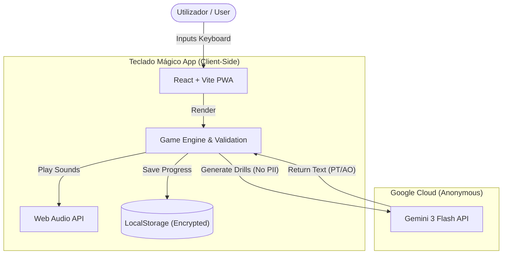

# Teclado Mágico | Magic Keyboard

> **PT**: Um treinador de digitação gamificado e impulsionado por IA, desenhado para crianças a aprender Português (Portugal e Angola).
> **EN**: A gamified, AI-powered typing trainer designed for children learning Portuguese (Portugal and Angola).

[](LICENSE)
[](https://www.typescriptlang.org/)
[](https://react.dev/)
[](https://deepmind.google/technologies/gemini/)
[](https://github.com/yourusername/teclado-magico)

---

## 📊 Estado Atual | Current Status (v1.3.0)

| Módulo (Module) | Estado PT | Status EN |
|-----------------|-----------|-----------|
| **Motor de Digitação** | ✅ Completo | ✅ Complete |
| **Teclado Visual 3D** | ✅ Completo | ✅ Complete |
| **Geração de Texto IA** | ✅ Completo (PT/AO) | ✅ Complete (PT/AO) |
| **Progressão (XP/Níveis)**| ✅ Completo | ✅ Complete |
| **Desafios Diários** | ✅ Completo | ✅ Complete |
| **Guia de Mãos** | ✅ Completo | ✅ Complete |
| **Modo História** | ✅ Completo | ✅ Complete |
| **Inclusão Cultural** | ✅ Completo | ✅ Complete |

---

## 🔒 Privacidade e Segurança (GDPR) | Privacy & Safety

Este projeto foi desenhado com o princípio de **"Privacy by Design"** para garantir a segurança das crianças online.

### 1. Sem Base de Dados (No Database)
*   **PT**: Não temos servidores. Todos os dados (nome do jogador, progresso, estrelas) são guardados **exclusivamente no dispositivo** (LocalStorage). Nós não temos acesso a essa informação.
*   **EN**: We have no servers. All data (player name, progress, stars) is stored **exclusively on the device** (LocalStorage). We do not have access to this information.

### 2. Uso de IA (AI Usage)
*   **PT**: Quando usamos a IA (Google Gemini) para gerar textos, enviamos apenas prompts anónimos (ex: "Cria uma frase com a letra A"). **Nenhum dado do perfil da criança é enviado para a Google.**
*   **EN**: When using AI (Google Gemini) to generate text, we only send anonymous prompts (e.g., "Create a sentence with letter A"). **No child profile data is sent to Google.**

### 3. Sem Rastreamento (No Tracking)
*   **PT**: Não utilizamos Google Analytics, Facebook Pixels ou cookies de terceiros para publicidade.
*   **EN**: We do not use Google Analytics, Facebook Pixels, or third-party advertising cookies.

---

## 🎯 Visão Geral | Overview

### PT-PT (Português)
**Teclado Mágico** é uma aplicação web educativa que ajuda crianças a dominar a digitação. Ao contrário de ferramentas genéricas, foca-se especificamente no contexto cultural de **Portugal e Angola**, utilizando vocabulário local (ex: Kwanza, Tejo, Imbondeiro) e gramática correta (tratando o utilizador por "Tu"). Utiliza a IA Gemini da Google para gerar exercícios infinitos e adaptados.

### EN-US (English)
**Teclado Mágico** is an educational web application that helps children master touch typing. Unlike generic tools, it focuses specifically on the cultural context of **Portugal and Angola**, using local vocabulary (e.g., Kwanza, Tejo, Baobab) and correct grammar (addressing the user as "Tu"). It uses Google's Gemini AI to generate infinite, adaptive typing drills.

---

## ✨ Funcionalidades Principais | Core Features

### 1. Inclusão Cultural (Portugal & Angola)
- **PT**: Exercícios que incluem nomes, cidades e referências culturais de ambos os países (Luanda, Lisboa, Benguela, Algarve, Imbondeiro).
- **EN**: Drills that include names, cities, and cultural references from both countries.

### 2. Teclas Invisíveis (Blind Mode)
- **PT**: Um modo de "Magia" que esconde as letras do teclado visual, forçando a criança a confiar na memória muscular.
- **EN**: A "Magic" mode that hides labels on the visual keyboard, forcing children to rely on muscle memory.

### 3. Aprendizagem Progressiva
- **PT**: 11 níveis distintos começando pela Linha Mágica (F & J) e expandindo para o alfabeto completo, números e símbolos.
- **EN**: 11 distinct levels starting from the Magic Line (F & J) expanding to the full alphabet, numbers, and symbols.

### 4. Sistema de Progressão RPG
- **PT**: Ganha **XP** por cada tecla. Sobe de nível para desbloquear **Títulos** fixes (ex: "Mestre das Palavras") e colecionar **Avatares**.
- **EN**: Earn **XP** for every key pressed. Level up to unlock cool **Titles** and collect fun **Avatars**.

### 5. Área de Pais e Professores
- **PT**: Uma área dedicada para ver o tempo de jogo, sessões completas e gerir perfis de vários alunos no mesmo dispositivo.
- **EN**: A dedicated area to view play time, sessions completed, and manage multiple student profiles on the same device.

### 6. Inteligência Artificial (Gemini)
- **PT**: Integração Google Gemini gera frases únicas a cada vez • Vocabulário consciente do contexto • Geração de exercícios focados nos erros.
- **EN**: Google Gemini integration generates unique sentences every time • Context-aware vocabulary • Error-focused drill generation.

---

## 🏗️ Arquitetura | Architecture

### Diagrama de Fluxo | Flow Diagram



### Stack Tecnológico

| Componente | Tecnologia | Propósito |
|------------|------------|-----------|
| **Frontend** | React 19 + TypeScript | UI e Lógica de Jogo |
| **Estilos** | Tailwind CSS | Design Responsivo |
| **Animações** | Framer Motion | Transições suaves |
| **Motor IA** | Google GenAI SDK | Geração Dinâmica de Conteúdo |
| **Gráficos** | Recharts | Visualização de Progresso |
| **Ícones** | Lucide React | Linguagem Visual |

---

## 🚀 Começar | Getting Started

### Pré-requisitos | Prerequisites
- Node.js 18+ 
- Google Gemini API Key

### Instalação | Installation

**1. Clonar o repositório**
```bash
git clone https://github.com/yourusername/teclado-magico.git
cd teclado-magico
```

**2. Instalar dependências**
```bash
npm install
```

**3. Configurar Ambiente**
Crie um ficheiro `.env`:
```env
API_KEY=a_sua_chave_api_aqui
```

**4. Iniciar servidor**
```bash
npm run dev
```

---

## 📄 Licença | License

Este projeto está licenciado sob a Licença MIT - ver ficheiro [LICENSE](LICENSE) para detalhes.

---

**Feito com ❤️ para a educação | Made with ❤️ for education**
