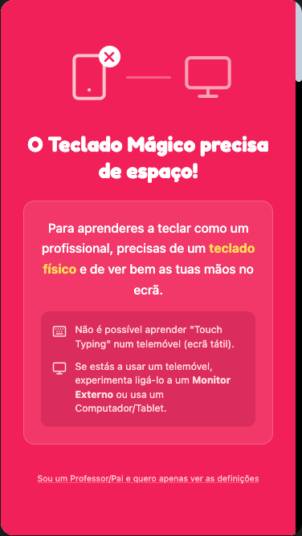
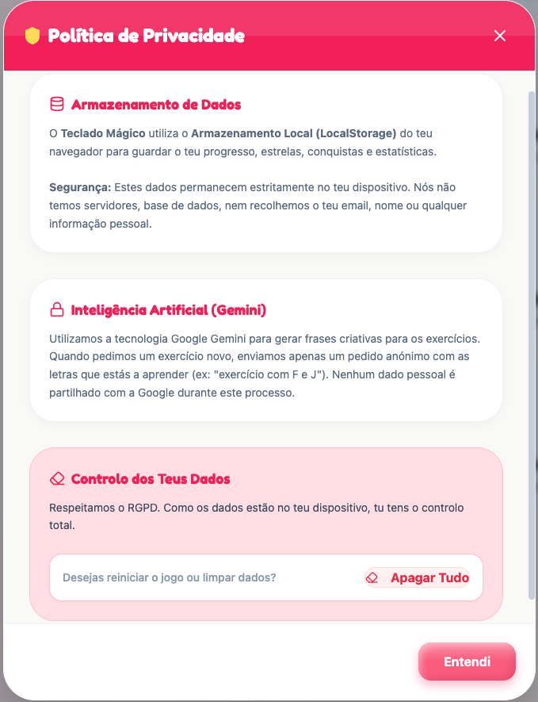
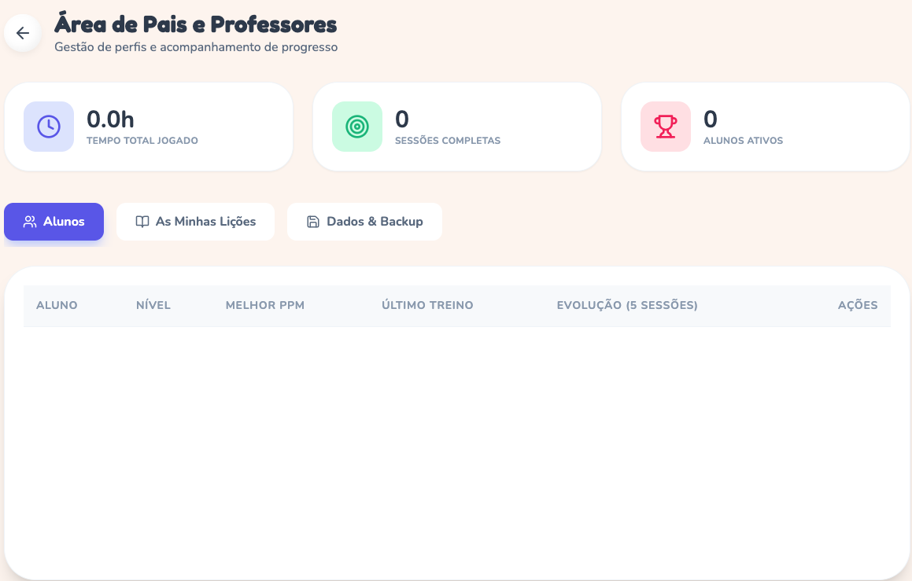
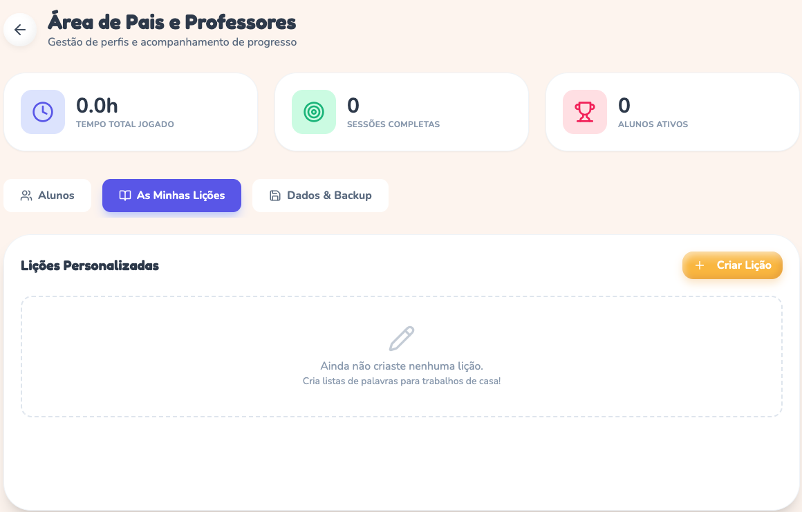
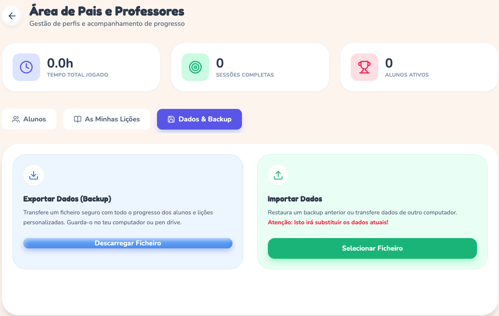

# Guia para Pais e Professores 👨‍👩‍👧‍👦

Bem-vindo ao **Teclado Mágico**! Este guia ajuda-o a configurar e tirar o máximo partido desta ferramenta educativa, desenhada para respeitar a identidade cultural das crianças.

## 1. Instalação (Funciona Offline!)

O Teclado Mágico é uma **PWA (Progressive Web App)**. Isto significa que pode ser instalado como uma aplicação nativa no seu computador ou tablet, sem precisar de ir à App Store.

*   **Google Chrome / Edge**: Clique no ícone de "Instalar" (computador com seta para baixo) na barra de endereço.
*   **Vantagem**: Uma vez instalada, a aplicação **funciona sem internet** (exceto para a geração de novos textos com IA, que reverte para textos de reserva se estiver offline).

> **Nota Importante**: O Teclado Mágico **NÃO** funciona em telemóveis na vertical. É necessário um teclado físico para aprender dactilografia corretamente.

  

## 2. Privacidade e Segurança de Dados

Nós levamos a segurança muito a sério.
*   **Sem Registo**: Não pedimos emails, passwords ou nomes reais obrigatórios.
*   **Dados Locais**: Todo o progresso, estrelas e lições são guardados **apenas no seu dispositivo** (no navegador).
*   **Conformidade RGPD**: Não existem "cookies de rastreamento" nem publicidade.

  

## 3. Criar e Gerir Perfis

Pode criar perfis para vários alunos no mesmo computador (ideal para irmãos ou salas de aula).

  

1.  No ecrã inicial, clique em **"Novo Jogador"**.
2.  Escolha um **Nome** e um **Avatar**.
3.  **Tema**: Pode escolher entre Rosa, Azul ou Âmbar (Amarelo). Isto altera as cores de todo o jogo para maior conforto visual.
4.  **Layout**: Se estiver em Portugal/Angola, escolha **QWERTY**. Se estiver em França/Bélgica, escolha **AZERTY**.

Para apagar um perfil, vá à **"Área de Pais e Professores"** (ícone da roldana) -> Separador **Alunos** -> Ícone do Lixo.

  

## 4. Lições Personalizadas (Novidade v1.4)

Quer que o seu filho treine palavras específicas para um ditado da escola?

1.  Entre na **Área de Pais**.
2.  Clique no separador **"As Minhas Lições"**.
3.  Clique em **"Criar Lição"**.
4.  Dê um título (ex: "Palavras com CH") e escreva o texto.
5.  O aluno poderá selecionar esta lição no menu principal, na secção "Lições Personalizadas".

  

## 5. Diplomas e Certificados 🏆

Celebre as conquistas! Quando o aluno atinge marcos importantes (como subir de nível):

1.  Vá ao menu **"O Meu Progresso"**.
2.  Clique no botão **"Diploma"**.
3.  Será gerado um PDF oficial com o nome do aluno, nível e estatísticas, pronto a imprimir e pendurar na parede!

## 6. Backup e Transferência de Dados

Como os dados ficam no computador, se mudar de PC, perde o progresso. Para evitar isto:

1.  Vá à **Área de Pais** -> Separador **"Dados & Backup"**.
2.  Clique em **"Exportar Dados"**. Será descarregado um ficheiro `.json`.
3.  No novo computador, faça o mesmo processo mas clique em **"Importar Dados"** e selecione esse ficheiro.

  

## 7. Identidade Cultural e Representatividade 🤝

Diferente de softwares genéricos, o Teclado Mágico foi desenvolvido com **Correção Étnica e Cultural** em mente:

*   **Nomes Inclusivos**: A IA gera exercícios com nomes comuns em Angola (ex: Zola, Njinga, Jamba) e Portugal (ex: João, Maria), promovendo o reconhecimento identitário.
*   **Contexto Local**: As frases referem realidades locais (Imbondeiros, Palancas, Rio Tejo, Azulejos) em vez de traduções literais do inglês.
*   **Respeito Linguístico**: O sistema valida a norma do Português Europeu/Angolano, evitando confusões gramaticais com variantes de outros continentes.

## 8. Dicas para Pais

*   **Postura**: Garanta que a criança está sentada com as costas direitas e os pés no chão.
*   **Mãos**: Os pulsos não devem pousar na mesa. Devem "flutuar" ligeiramente acima do teclado.
*   **Regularidade**: 15 minutos por dia é muito melhor do que 2 horas uma vez por semana.
